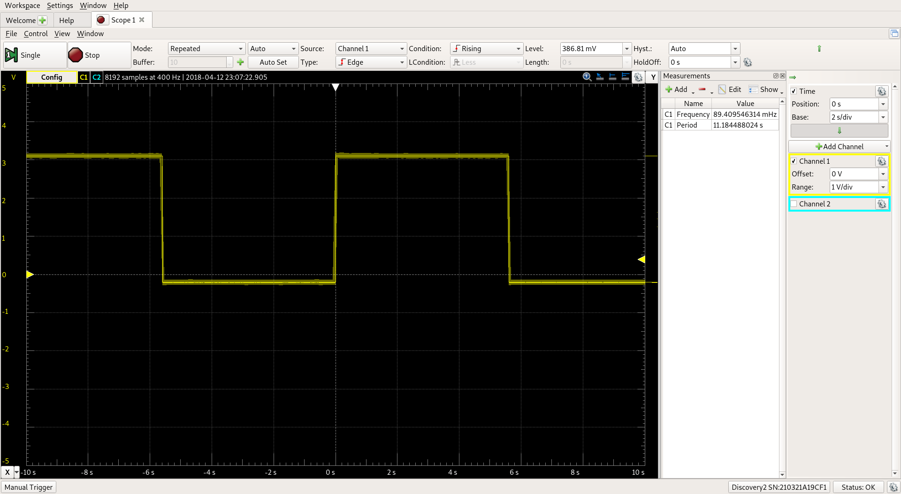
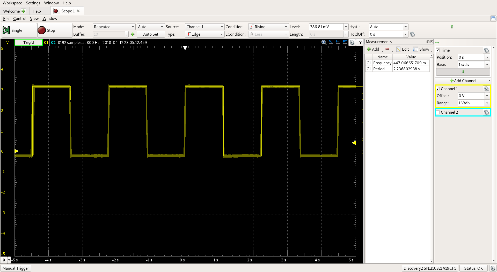
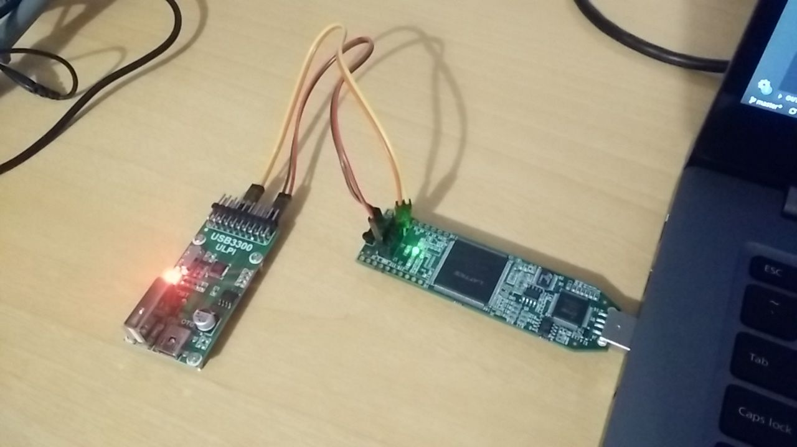

# Información

Prueba que verifica la posibilidad de utilizar un reloj externo a la FPGA, con frecuencia superior a 12MHz. *[12/04/2018, 15:55]*

## Partes de la prueba

1. Circuito en Verilog, `clock.v`, que crea un divisor de longitud variable y redirecciona los 5 bits mas significativos a los LEDs integrados de la placa ICEstick.
2. Mini-programa en Python3 para para calcular rápidamente valores de divisores a utilizar según la frecuencia de reloj o el tiempo deseado.
    * En este caso se ha utilizado un divisor de valor 27 para probar que se generaba una señal de periodo 2.25s. Ese valor se ha obtenido por medio de `./get_divider.py 12000000 2`

## Resultados

1. Verificación a 12MHz internos:
    * Utilizando un divisor de valor 27, teóricamente (`./get_divider.py 12000000 27 -t`) obtendremos una señal de 11.18s de periodo, valor que coincide con el valor medidos.
    

2. 60MHz externos:
    * De igual manera, utilizando el reloj de salida del módulo USB3300, teóricamente (`./get_divider.py 60000000 27 -t`) deberíamos obtener una señal de 2.23s de periodo, valor que de nuevo coincide, **verificando que si es posible utilizar 60MHz**.
    

3. Banco de pruebas utilizado
    